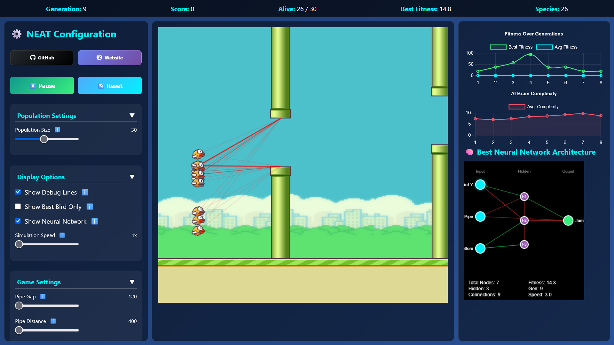

# NEAT Flappy Bird AI

## Overview
An implementation of the Flappy Bird game where the AI learns to play using the NEAT (NeuroEvolution of Augmenting Topologies) algorithm. The AI birds evolve over generations to navigate through pipes by learning from their mistakes.

## Features
- 🎮 Interactive Flappy Bird game with NEAT-based AI
- 🧠 Neural network visualization showing the AI's decision-making process
- 📊 Real-time performance metrics and evolution statistics
- ⚙️ Customizable NEAT parameters for experimentation
- 🎨 Clean and responsive UI with game controls

## How It Works
1. The AI uses a neural network with inputs for the bird's position and upcoming pipe locations
2. Each generation, the best-performing birds are selected to reproduce
3. The neural networks evolve through mutation and crossover
4. Over time, the AI learns to navigate through the pipes more effectively

## Getting Started
1. Clone the repository
2. Open `index.html` in a modern web browser
3. Click the "Play" button to start the simulation
4. Use the controls to adjust parameters and observe the AI learning

## Controls
- **Play/Pause**: Start or pause the simulation
- **Reset**: Restart the simulation with a new population
- **Speed Control**: Adjust the simulation speed
- **Display Options**: Toggle various visual elements

## Customization
You can modify the NEAT parameters in the left panel to experiment with different:
- Population size
- Mutation rates
- Network architecture
- Selection criteria

## Dependencies
- Modern web browser with JavaScript enabled
- No server required - runs entirely client-side

## Screenshots

### Game View

### Neural Network Visualization

## License
This project is open source and available under the MIT License.

## Author
[Your Name]

## Acknowledgments
- NEAT algorithm by Kenneth O. Stanley and Risto Miikkulainen
- Flappy Bird game concept by Dong Nguyen
